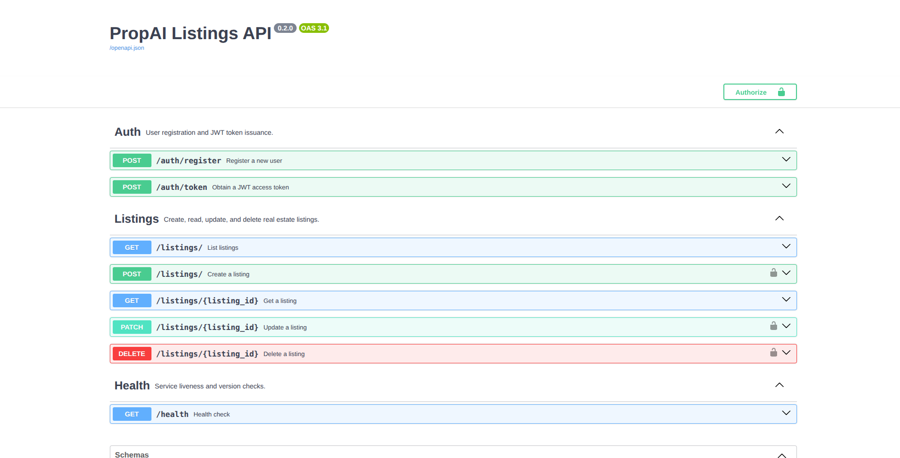

# PropAI Listings API

A property listings REST API built with FastAPI, PostgreSQL, and Docker Compose.

## Tech Stack

- FastAPI
- PostgreSQL 16
- SQLAlchemy + Alembic
- Docker Compose
- Python 3.12

## Getting Started

### Prerequisites
- Docker
- Docker Compose

### Run locally

```bash
git clone https://github.com/anatota/propai-listings
cd propai-listings
cp .env.example .env
# fill in .env values
docker compose up --build
```

API: http://localhost:8000  
Docs: http://localhost:8000/docs  
pgAdmin: http://localhost:5050

## Demo

[Watch the demo on YouTube](https://youtu.be/ixxKN8auN1Y)

## API Documentation

Interactive docs are available at **http://localhost:8000/docs** (Swagger UI) once the stack is running. All endpoints, request/response schemas, and auth flows can be explored and tested there directly.



## Endpoints

| Method | Path | Auth required | Description |
|--------|------|:---:|-------------|
| `GET` | `/health` | ❌ | Returns service status and current API version. |
| `POST` | `/auth/register` | ❌ | Creates a new user account. Rejects duplicate emails with 400. |
| `POST` | `/auth/token` | ❌ | Authenticates via OAuth2 password flow and returns a Bearer token. |
| `GET` | `/listings` | ❌ | Paginated listing index. Optional filters: `city`, `min_price`, `max_price`, `property_type`, `is_for_rent`. |
| `GET` | `/listings/{id}` | ❌ | Fetches a single listing by ID. Returns 404 if not found. |
| `POST` | `/listings` | ✅ | Creates a listing owned by the authenticated user. |
| `PATCH` | `/listings/{id}` | ✅ | Partially updates a listing. Returns 403 if the requester is not the owner. |
| `DELETE` | `/listings/{id}` | ✅ | Permanently deletes a listing. Returns 403 if the requester is not the owner. |

Protected endpoints require an `Authorization: Bearer <token>` header. Obtain a token from `POST /auth/token`.

## Running Tests

Tests use an isolated SQLite database and do not require a running Docker stack or a `.env` file.

```bash
# Run the full test suite
.venv/bin/pytest tests/

# Run a single test with verbose output
.venv/bin/pytest tests/test_listings.py::test_create_listing -v
```

The `setup_db` fixture in `conftest.py` creates and drops the test database around each test, so tests are fully isolated and can be run in any order.

## Built with AI
### Day 0 — Project Plan
**Tools: Claude (web)**

**How I worked:**

Used Claude web app for project idea generation and day-by-day planning. Asked it to generate an artifact covering the full 4-day schedule, relevant resources, example projects, and best prompting practices for AI-assisted development. 

---

### Day 1 — Foundation
**Tools: Claude (web), GitHub Copilot, Codex**

**How I worked:**

I used AI as a mentor throughout — not just to generate code, but to explain every decision as it was made. Before writing a single line, I asked Claude to help design the data model and project structure so I understood what I was building and why. The boilerplate prompt came from that conversation and was run via Codex. I then asked the Codex agent to check for errors and fix them. Whenever I didn't understand an error or a terminal command, I used inline chat in order to explain the underlying concepts.

Every unfamiliar concept got questioned in real time — how Docker networking works inside Compose, what the correct build order is and why.

One concrete example of this thinking: when setting up Docker, I asked specifically about running commands without `sudo`. That led to understanding how Docker group membership works on Ubuntu, which is the kind of systems-level detail that matters in a real environment.

**Engineering decisions:**

- Chose to run everything in Docker (API + Postgres + pgAdmin) rather than running FastAPI locally — consistent environment from day one, no "works on my machine" problems
- Included pgAdmin for DB visibility during development — being able to inspect the actual tables while building the API layer made debugging faster
- Database-first build order: models → migrations → API. The API imports models at startup; building it in the wrong order means you can't run anything

**What I learned:**

- `depends_on` with a healthcheck prevents the API container from starting before Postgres is actually ready — without it, you get connection errors on startup because Docker starts containers in parallel
- `DATABASE_URL` inside Docker uses the Compose service name as the hostname, not `localhost` — `localhost` inside a container refers to the container itself
- When I noticed I didn't understand what had been done, asked for a breakdown before moving on — migration tools, why they exist, what `--autogenerate` actually does
- Alembic tracks schema changes the same way Git tracks code changes. `--autogenerate` compares your models to the actual DB state and generates a migration file
- Migration tools exist because in production you can't just `DROP TABLE` and recreate — you need to evolve the schema safely without data loss

---

### Day 2 — Core CRUD
**Tools: Claude Code (agent), Claude (web)**

**How I worked:**

Day 2 was more focused. I had a working foundation and a clear prompt. Used Claude Code as the primary agent with a structured prompt specifying exact files, Pydantic version, and test constraints. Used Claude web to understand what was generated.

**Engineering decisions:**

- Kept `PATCH` instead of `PUT` after understanding the difference: PUT replaces the entire resource, PATCH updates only the fields provided. Partial update is the correct behavior for an edit endpoint
- Constrained the agent explicitly: do not touch `models.py` or `database.py` — separation of concerns, those were already correct
- Required the agent to use Pydantic v2 syntax explicitly — without that constraint it would have generated v1, which still runs but is deprecated

**Where AI went wrong / what I corrected:**

- Generated `PATCH` instead of the `PUT` specified in the plan — correct call semantically, but an undiscussed deviation. Kept it deliberately after understanding why
- Tests use SQLite instead of Postgres. SQLite doesn't enforce foreign keys by default and doesn't support Postgres-specific types — tests pass but don't fully reflect production behavior. Acceptable for this project (though I challenged Claude if this was the right decision 😄)
- First test run failed because `DATABASE_URL` isn't set in the test environment. `app.database` reads it at import time, so pytest crashed before running a single test. Agent self-diagnosed and added `conftest.py` to set a dummy value before imports run
- `POST /listings` currently requires `owner_id` in the request body — correct behavior would be extracting it from a JWT token. Deferred to Day 3, requires a manually seeded user in the DB to test
- I did not like that http://localhost:8000/ showed {"detail":"Not Found"}. Therefore, I added root endpoint where it simply redirects to the docs page

**What I learned:**

- PUT vs PATCH: PUT is a full replacement (send all fields), PATCH is a partial update (send only what changes). Most edit endpoints should be PATCH
- Pydantic schemas are the contract between the API and the outside world — they define what shape data must arrive in, validate types before anything touches the DB, and control what shape data leaves in the response. `Base → Create → Update → Response` is a clean separation of those concerns
- `conftest.py` is pytest's auto-loaded configuration file — anything defined there is available to all tests without importing. It runs before test collection, which is why it's the right place to set env vars that need to exist before imports happen
- FastAPI's `dependency_overrides` replaces the real DB with a test DB by swapping the `get_db` function at runtime — the endpoints don't know anything changed, which is what makes it a proper test isolation pattern
- The 11 tests cover: create (happy path, minimal fields, missing required), read (single, not found, list, pagination), update (partial update, not found), delete (success + verify gone, not found)
- Foreign key constraints are enforced by Postgres at the DB level — the 500 error on POST wasn't a code bug, it was the database correctly rejecting a listing pointing to a non-existent user

---

### Day 3 — Auth, Filters, Pagination
**Tools: Claude Code (agent)**

**How I worked:**

Gave the agent a structured Day 3 brief covering all goals upfront: JWT auth, query filters, pagination, error standardization, and tests. Reviewed the generated code before running tests, then let the agent self-diagnose and fix a dependency conflict it introduced.

**Engineering decisions:**

- Stored only the user ID (`sub` claim) in the JWT — no email, no roles. The token is a key, not a profile; anything else can be fetched from the DB when needed
- `owner_id` is no longer accepted in the request body — it's extracted from the token. Clients can't forge ownership
- `?city=` filters on the `location` field using a case-insensitive LIKE, rather than adding a separate `city` column — avoids a migration and is good enough for the current data shape
- Replaced `skip/limit` pagination with `page/page_size` and a paginated response envelope (`{"total": N, "page": N, "page_size": N, "items": [...]}`) — total count is essential for any frontend building pagination controls
- Ownership check returns 403, not 404 — returning 404 on an existing resource would be misleading. 403 correctly communicates "found it, but no"
- Global `HTTPException` handler adds a `"code"` field to every error response — consistent shape means the client never has to guess the response structure on failure

**Where AI went wrong / what I corrected:**

- Dependency conflict: the agent added `passlib[bcrypt]` to requirements but didn't pin `bcrypt` itself. `pip` installed `bcrypt 5.0.0`, which had a breaking API change that passlib 1.7.4 doesn't handle — `hashpw` now raises `ValueError` for long internal test secrets and `__about__` was removed. The agent diagnosed the cause and pinned `bcrypt==4.0.1`

**What I learned:**

- JWTs are stateless — the server signs the token at login and never stores it. Every subsequent request is verified by re-decoding the signature, with no DB lookup needed until the payload is trusted. This is why token expiry matters: there's no server-side session to invalidate
- `OAuth2PasswordRequestForm` expects `application/x-www-form-urlencoded`, not JSON — this is the OAuth2 spec. Sending JSON to the token endpoint returns 422. Required adding `python-multipart` as a dependency
- 401 means "you are not authenticated" (no valid token). 403 means "you are authenticated but not allowed" (wrong owner). Using them interchangeably is a common mistake that leaks information or confuses clients
- `passlib` is a wrapper library — it delegates the actual hashing to a backend (here, `bcrypt`). The wrapper API is stable, but the backend is a separate package with its own release cycle. Pinning both is the right call
- SQLAlchemy's `.ilike()` compiles to `ILIKE` on Postgres (native case-insensitive) and to `LOWER(x) LIKE LOWER(y)` on SQLite — the same ORM call works correctly on both without any conditional logic
- 30 tests total (up from 11): added auth flow, filter combinations, and ownership enforcement across both users

---

### Day 4 — Documentation, Seed Data, and Polish
**Tools: Claude Code (agent)**

**How I worked:**

Day 4 was about making the project presentable and usable beyond the happy path. No new features — the goal was to make what already existed easier to understand and easier to run. Gave the agent focused, scoped prompts for each piece: one for OpenAPI metadata, one for the seed script, one for the README. Reviewed each output before moving on rather than chaining them blindly.

**Engineering decisions:**

- Added `summary`, `description`, and `tags` to every endpoint decorator rather than relying on function names — FastAPI generates OpenAPI from decorators, not docstrings, so that's the right place to put it
- Used exactly four tags (`Auth`, `Listings`, `Users`, `Health`) and registered them in `openapi_tags` on the `FastAPI()` instance — tags defined there appear in the Swagger UI sidebar in a fixed order with descriptions, rather than in the order FastAPI first encounters them
- Marked `GET /` with `include_in_schema=False` — it's a redirect to `/docs`, not an API endpoint; including it in the schema would be noise
- Seed script imports directly from `app.models` and `app.database` rather than hitting the API — avoids token flow, and lets it run before any user exists. `Base.metadata.create_all` makes it safe to run before or after migrations
- Made the seed idempotent by deleting all listings before inserting — simpler and more predictable than checking for duplicates. Admin user is upsert-style: checked before creating, never deleted
- Listings are spread across eight Tbilisi districts and four Batumi areas, with a realistic mix of property types, prices, and rental/sale status — the goal was data that would expose real filtering and pagination behavior, not just pass insert tests

**Where AI went wrong / what I corrected:**

- The seed script used `db.query(Listing).delete()` on every run, meaning it would wipe all listings on every container restart — including any real user data. The AI did not flag this as a problem. I caught it and directed the fix: wrap the inserts in an existence check so seeding only runs once on an empty table
- `alembic.ini` was missing from the repository entirely. The Docker Compose command runs `alembic upgrade head` on startup, which requires this file to locate the migration scripts. The container was crashing immediately with `No config file 'alembic.ini' found`. I spotted the error, the agent generated the missing file

**Regression testing:**

After adding automatic seeding (run once on empty database on container startup), the full test suite was rerun to confirm nothing broke. All 30 tests passed — auth, listing CRUD, filters, pagination, and ownership enforcement. This was a regression run: no new functionality was added, the goal was to verify that the seeding logic and structural changes hadn't silently broken existing behavior.

**What I learned:**

- OpenAPI tags are cosmetic in the spec but have a real impact on usability — a Swagger UI with labelled, ordered groups is immediately navigable; one with auto-generated tags is not
- `summary` and `description` serve different audiences: summary is the one-liner in the endpoint list, description is what someone reads when they expand it to understand behaviour. Keeping them at different levels of detail is worth the extra lines
- A seed script is also a form of documentation — reading through realistic data immediately communicates what the data model is meant to hold and what combinations are valid